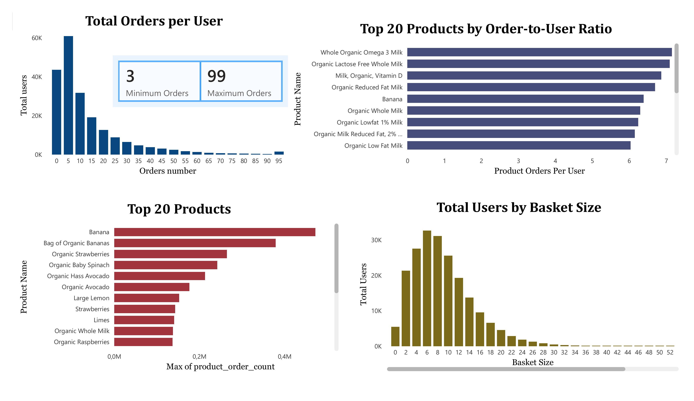
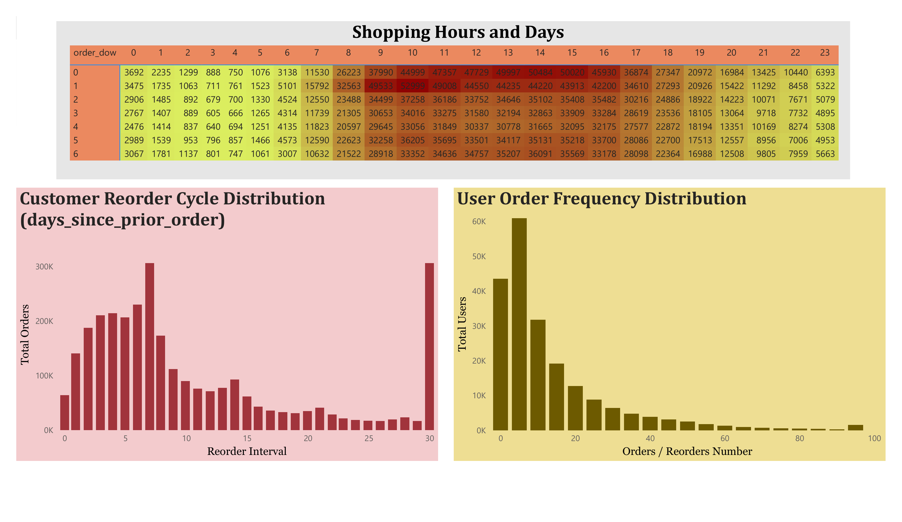
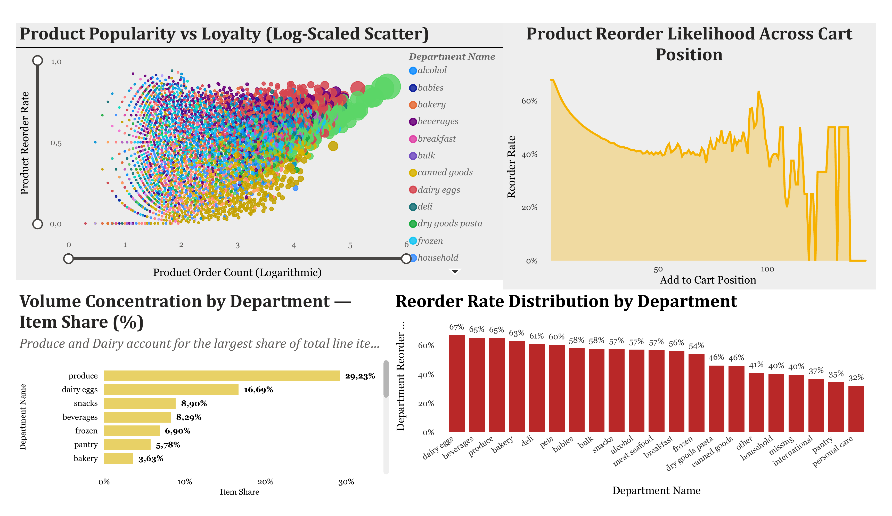

# Predictive Analytics using SQL and Machine Learning: The case of Instacart

## Overview
This repository contains the code developed for my Master's thesis, which focuses on predictive analytics using SQL-based feature engineering and machine learning techniques applied to the Instacart Online Grocery dataset. The project includes exploratory data analysis, feature engineering in PostgreSQL, machine learning modeling in Python, and interactive dashboards built in Power BI.

## Thesis Title
*Predictive Analytics using SQL and Machine Learning: The case of Instacart*

## Dataset
The [Instacart Online Grocery Shopping Dataset](https://www.kaggle.com/datasets/psparks/instacart-market-basket-analysis) contains anonymized data on over 3 million grocery orders from more than 200,000 users.

## Repository Structure
sql/

├── 01_db_creation.sql          # Database schema and table creation

├── 02_data_import.sql          # Data import and loading

├── 03_ml_dataset.sql           # ML dataset construction

├── 04_feature_engineering_product.sql    # Product-level features

├── 05_feature_engineering_user_product.sql  # User-product interaction features

└── 06_feature_engineering_user.sql       # User-level features

├── 07_user_feature_table.sql                # User feature table

├── 08_product_feature_table.sql             # Product feature table

└── 09_user_product_feature_table.sql        # User-product feature table

dashboards/

├── dashboard_general.png                    # Orders, top products & basket size

├── dashboard_user.png                       # Shopping hours, reorder cycle & frequency

└── dashboard_product.png                    # Product popularity, loyalty & department analysis

## Power BI Dashboards

Interactive dashboards built in Power BI to explore the feature-engineered data.

**General Overview**

Total orders per user, top 20 products by order-to-user ratio, most ordered products, and basket size distribution.

**User Behavior**

Shopping activity by hour and day of week, customer reorder cycle distribution, and user order frequency distribution.

**Product Analysis**

Product popularity vs. reorder loyalty, reorder likelihood by cart position, and volume/reorder rate concentration by department.

## Tools & Technologies
- **Database:** PostgreSQL 17
- **Query Tool:** pgAdmin 4
- **BI Tool:** Power BI
- **Language:** Python (in progress)
- **Version Control:** Git / GitHub

## Status
🔄 In progress - expected completion: October 2026
